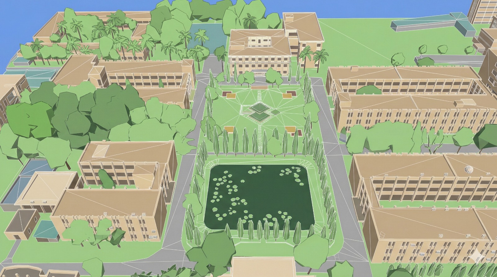

# KUET Campus: Real-time 3D Interactive Virtual Tour

> **A comprehensive 3D visualization of KUET (Khulna University of Engineering & Technology) campus environment using advanced OpenGL graphics, featuring dynamic day-night cycles, interactive NPCs, physics simulation, and immersive real-time rendering.**



---

## 📋 Table of Contents

- [Project Overview](#project-overview)
- [Video Overview & Media](#video-overview--media) 
- [Key Features](#key-features)
- [Technical Architecture](#technical-architecture)
- [Project Structure](#project-structure)
- [Technologies & Dependencies](#technologies--dependencies)
- [Installation & Setup](#installation--setup)
- [Build Instructions](#build-instructions)
- [Usage & Controls](#usage--controls)
- [Core Features in Detail](#core-features-in-detail)
- [System Components](#system-components)
- [File Structure](#file-structure)
- [Advanced Graphics Techniques](#advanced-graphics-techniques)
- [Physics & Collision Detection](#physics--collision-detection)
- [Future Enhancements](#future-enhancements)
- [Contributors](#contributors)

---

## 🎯 Project Overview

**KUET Campus: Virtual Tour** is an advanced computer graphics capstone project that creates an immersive, real-time 3D interactive environment of the KUET campus. The project demonstrates sophisticated graphics programming concepts including hierarchical modeling, dynamic lighting systems, physics simulations, and autonomous NPC agents.

This application showcases a complete game engine-like system built from scratch using OpenGL, featuring:
- **Real-time rendering** with advanced shading techniques
- **Dynamic day-night cycle** with realistic lighting transitions
- **Autonomous NPC simulation** with student scheduling and behaviors
- **Physics-based interactions** with collision detection
- **Multiple camera modes** for exploration and navigation
- **Procedurally generated elements** using fractals and curves
- **Extensive texture mapping** with normal mapping support

---

## 🎥 Video Overview & Media

### YouTube Video Link (Placeholder)
> **Day night Transition:**  
> *Check* [https://youtu.be/GTkklL8xq2Q](https://youtu.be/GTkklL8xq2Q)
> **Watch the full campus tour and feature on YouTube:**  
> *Check:* [https://youtu.be/15VdDJYxvtY](https://youtu.be/15VdDJYxvtY)
> **Random bird path and Wind simulation Tree leaves fractals**  
> *Check:* [https://www.youtube.com/watch?v=w35PlbS7BvE](https://www.youtube.com/watch?v=w35PlbS7BvE)


### 🖼️ Viewport Images
Below are placeholder references for viewport screenshots. Replace the file paths with your actual images.

| Viewport | Description | Image |
|----------|-------------|-------|
| **Viewport 1** | First‑person free‑roam mode | `[viewport1.png]` |
| **Viewport 2** | Ground‑clamped “car” mode | `[viewport2.png]` |
| **Viewport 3** | Day‑night transition (night view) | `[viewport3.png]` |

> **Note:** Add the actual image files (e.g., `viewport1.png`, `viewport2.png`, `viewport3.png`) to your repository and update the markdown links accordingly.

---

## ✨ Key Features

### 🌍 Dynamic Day-Night Cycle System
- **Four distinct phases**: Morning, Noon, Evening, and Night
- **Real-time sky color transitions** based on time of day
- **Sun and moon positioning** with accurate astronomical calculations
- **Dynamic lighting changes** that affect the entire scene
- **Customizable cycle speed** for demonstration purposes
- **Texture transitions** for sun (red sunrise to yellow noon)

### 🏢 Hierarchical Scene Modeling
- **Complex building structures** with proper parent-child relationships
- **Procedural geometry generation** using fractals and mathematical curves
- **Modular object system** for easy campus element management
- **Tree structures** with animated branches and foliage
- **Water features** with dynamic shader effects
- **Architectural landmarks**: Academic buildings, stadiums, fountains

### 🎮 Advanced Lighting System
- **Phong illumination model** with multiple light types:
  - **Directional lighting** (sun and moon)
  - **Point lights** (campus streetlights, building lights)
  - **Spotlight effects** (focused beam illumination)
- **Per-fragment lighting calculations** for realistic shading
- **Texture-based normal mapping** for surface detail enhancement
- **Light switching system** for realistic campus lighting scenarios
- **Ambient occlusion** and shadow simulation

### 🚗 Interactive Camera System
- **Free-roam first-person perspective** with smooth movement
- **Car mode (ground-clamped)** for constrained navigation
- **Mouse-controlled look-around** with adjustable sensitivity
- **Zoom capabilities** for detailed inspection
- **Real-time collision detection** preventing camera phasing through buildings
- **Smooth camera transitions** between movement states

### 🚶 Autonomous NPC System
- **Student NPCs** with:
  - Complex behavioral state machine (going to class, in class, in hall, etc.)
  - Scheduled daily activities
  - Path-finding and navigation
  - Collision detection with environment
  - Realistic interaction with campus facilities
- **Flying bird entities** with:
  - Flocking behaviors
  - Wing animation system
  - Wind simulation integration
  - Dynamic spawning and despawning

### ⚙️ Physics & Collision Detection
- **AABB (Axis-Aligned Bounding Box)** collision system
- **Sliding collision resolution** for smooth object interaction
- **Projectile physics** with bouncing simulation
- **Velocity-based movement** with acceleration and deceleration
- **Wind simulation** affecting trees and flying entities
- **Gravity simulation** for falling objects

### 🎨 Advanced Rendering Techniques
- **Multiple texture modes**:
  - Texture-only rendering
  - Texture with normal mapping
  - Vertex color rendering
  - Emissive (self-illuminating) materials
  - Animated water shader with time-based displacement
- **Gouraud and Phong shading** support
- **Material system** with customizable properties:
  - Ambient, diffuse, specular, emissive components
  - Shininess/roughness parameters
- **Bump mapping** for enhanced surface detail

### 🎭 Interactive Elements
- **Projectile system** for object launching
- **Real-time parameter control**:
  - Light on/off toggles
  - Wind intensity adjustment
  - Day-night cycle speed control
  - Lighting mode switching
- **Scene statistics display** (FPS, light count, entity count)

---

## 🏗️ Technical Architecture

### Rendering Pipeline
```
Input Processing → Camera Update → Physics Update → Collision Resolution
    ↓
Render Loop:
├─ Clear Frame Buffer
├─ Update Uniforms (Time, Lighting, Matrices)
├─ Render Campus Structures
├─ Render Dynamic Entities (Birds, NPCs)
├─ Render Projectiles
├─ Render Skybox/Sky
└─ Swap Buffers
```

### Shader Architecture
- **Vertex Shaders**: Handle vertex transformations, wind effects, and Gouraud lighting
- **Fragment Shaders**: Implement Phong illumination, texture sampling, normal mapping, and effects

### Hierarchical Transform System
- Parent-child relationships for complex objects
- Local and world coordinate systems
- Efficient transform matrix caching

---

## 📁 Project Structure

```
KUETCampus/
├── main.cpp                          # Main application logic & rendering loop
├── camera.h                          # Camera system & movement control
├── entities.h                        # NPC and bird entity definitions
├── physics.h                         # Collision detection & physics simulation
├── day_night.h                       # Day-night cycle and lighting system
├── shader.h                          # Shader compilation and management
├── stb_image.h                       # Image loading library
├── stb_truetype.h                    # Font rendering library
├── KUETCampus.sln                   # Visual Studio solution file
├── KUETCampus.vcxproj               # Visual Studio project configuration
│
├── assets/                           # Game assets
│   ├── academic_building.jpeg        # Architectural reference
│   ├── central_field.jpeg            # Campus field reference
│   ├── student_welfare_center.jpeg   # Building reference
│   ├── shahidminar.jpeg              # Landmark reference
│   │
│   ├── Textures:
│   ├── grass.jpg                     # Ground texture
│   ├── brick.jpg                     # Building material
│   ├── concrete.jpg                  # Concrete surfaces
│   ├── marble.jpg                    # Decorative surfaces
│   ├── wood.jpg                      # Building interiors
│   ├── water.jpg                     # Water features
│   ├── road.png                      # Road texture
│   ├── kuethood.png                  # University logo
│   ├── interior.png                  # Interior surfaces
│   │
│   ├── Celestial:
│   ├── redsun.jpg/png                # Sunrise/sunset sun texture
│   ├── yellowsun.png                 # Noon sun texture
│   ├── moon.png                      # Moon texture
│   │
│   └── Documentation:
│       └── PRESENTATION_SLIDES.md    # Project presentation content
│       └── 2007054_Presentation_Virtual_Campus_Tour.pptx
│
└── Build Output:
    └── x64/Debug/                    # Compiled binaries & intermediates
```

---

## 🛠️ Technologies & Dependencies

### Core Technologies
| Component | Version | Purpose |
|-----------|---------|---------|
| **C++** | C++17 | Primary programming language |
| **OpenGL** | 3.3+ | Graphics rendering API |
| **GLFW** | 3.x | Window management & input handling |
| **GLM** | 0.9.9+ | Mathematics library (vectors, matrices) |
| **GLAD** | Latest | OpenGL function loader |

### Supporting Libraries
- **stb_image.h** - Image file loading (JPG, PNG, etc.)
- **stb_truetype.h** - Font rendering and text display

### Development Environment
- **IDE**: Visual Studio 2019/2022
- **Platform**: Windows 10/11
- **Compiler**: MSVC (Visual C++)
- **Build System**: Visual Studio Solution (.sln)

---

## 🚀 Installation & Setup

### Prerequisites
- Windows 10/11 operating system
- Visual Studio 2019 or 2022
- C++ development tools
- Graphics card supporting OpenGL 3.3+

### Step 1: Clone the Repository
```bash
git clone https://github.com/yourusername/KUETCampus.git
cd KUETCampus
```

### Step 2: Set Up Dependencies
1. Download and install required libraries:
   - **GLFW**: [https://www.glfw.org/download.html](https://www.glfw.org/download.html)
   - **GLM**: [https://github.com/g-truc/glm](https://github.com/g-truc/glm)
   - **GLAD**: Use the [GLAD generator](https://glad.dav1d.de/) to generate OpenGL 3.3 core profile

2. Create a `dependencies/` folder in the project root:
   ```
   dependencies/
   ├── glfw/
   ├── glm/
   └── glad/
   ```

3. Copy extracted files into respective folders

### Step 3: Configure Include Paths
1. Open `KUETCampus.vcxproj` in Visual Studio
2. Go to Project → Properties
3. Configure include directories:
   - C/C++ → General → Additional Include Directories
   - Add paths to `glfw/include`, `glm`, and `glad/include`
4. Configure library directories:
   - Linker → General → Additional Library Directories
   - Add path to `glfw/lib-vc2022` (or your VC version)
5. Add library dependencies:
   - Linker → Input → Additional Dependencies
   - Add: `glfw3.lib opengl32.lib`

### Step 4: Place Assets
Ensure all texture files (`.jpg`, `.png`) are in the project root directory or in an `assets/` folder with appropriate path configurations in `main.cpp`.

---

## 🔨 Build Instructions

### Build from Visual Studio
1. Open `KUETCampus.sln` in Visual Studio
2. Select configuration: **Debug** or **Release**
3. Select platform: **x64**
4. Build → Build Solution (Ctrl+Shift+B)
5. Run → Start Without Debugging (Ctrl+F5)

### Build from Command Line
```bash
# Using Visual Studio Developer Command Prompt
msbuild KUETCampus.sln /p:Configuration=Debug /p:Platform=x64

# Or using cmake if cmake configuration is available
cmake -B build
cmake --build build --config Debug
```

### Expected Build Output
- Executable: `x64/Debug/KUETCampus.exe`
- Intermediate files: `x64/Debug/` directory

---

## 🎮 Usage & Controls

### Keyboard Controls

| Key | Function |
|-----|----------|
| **W / ↑** | Move forward |
| **A / ←** | Move left |
| **S / ↓** | Move backward |
| **D / →** | Move right |
| **SPACE** | Move up / Disable ground clamp |
| **C** | Enable ground clamp (car mode) |
| **1** | Toggle directional light (sun) |
| **2** | Toggle point lights |
| **3** | Toggle spot light |
| **4** | Increase wind |
| **5** | Decrease wind |
| **L** | Increase day-night cycle speed |
| **K** | Decrease day-night cycle speed |
| **E** | Increase ambient light strength |
| **Q** | Decrease ambient light strength |
| **V** | Switch viewport/rendering mode |
| **T** | Launch projectile (throwable object) |
| **ESC / X** | Exit application |

### Mouse Controls

| Input | Function |
|-------|----------|
| **Mouse Movement** | Look around (free-roam) |
| **Mouse Scroll** | Zoom in/out |

### Launch Parameters
```bash
# Run with default settings
KUETCampus.exe

# Add custom parameters (if implemented)
KUETCampus.exe --fps 60 --fullscreen
```

---

## 🎨 Core Features in Detail

### 1. Day-Night Cycle System

The day-night cycle operates on a continuous loop with four distinct phases:

```cpp
Morning (20s)  →  Noon (20s)  →  Evening (20s)  →  Night (10s)  → Repeat
```

**Features:**
- **Sky color gradients**: Smooth transitions between phase-specific colors
- **Sun positioning**: Follows a realistic arc across the sky
- **Lighting adjustments**: Automatic intensity and color changes
- **Texture switching**: Red sun during sunrise/sunset, yellow during noon
- **Phase-specific effects**: Moon visibility increases at night

**Implementation Details:**
- Located in: [day_night.h](day_night.h)
- Uses trigonometric functions for sun position calculations
- Linear interpolation (lerp) for smooth color transitions
- Time-based phase progression

### 2. Camera System

**First-Person Perspective:**
- Smooth movement with acceleration
- Mouse-based rotation (Euler angles: Yaw & Pitch)
- Customizable movement speed and mouse sensitivity

**Ground-Clamped Mode (Car Mode):**
- Restricts movement to horizontal plane (XZ axis)
- Maintains constant height above ground
- Prevents flying, useful for grounded navigation
- Automatic re-positioning when colliding with obstacles

**Implementation Details:**
- Located in: [camera.h](camera.h)
- View matrix computed using `glm::lookAt()`
- Camera vectors (Front, Right, Up) updated based on Euler angles
- Collision-aware positioning

### 3. Autonomous NPC System

**Student NPCs:**
- Behavioral states: `GOING_TO_CLASS`, `IN_CLASS`, `GOING_TO_HALL`, `IN_HALL`
- Scheduled activities with time-based transitions
- Path following with collision avoidance
- Animated character models with walking cycles

**Bird Entities:**
- Flocking behavior with target-seeking
- Wing animation synchronized to velocity
- Wind response system
- Perching and flying states

**Implementation Details:**
- Located in: [entities.h](entities.h)
- State machine for behavior logic
- Velocity-based movement calculations
- Animation blending between states

### 4. Advanced Lighting

**Light Types:**

| Type | Properties | Use Cases |
|------|-----------|-----------|
| **Directional** | Position-independent, infinite distance | Sun/Moon |
| **Point Light** | Position-dependent, attenuation | Street lamps, building lights |
| **Spotlight** | Direction + position, cone angle | Focused beams, stage lights |

**Phong Illumination Model:**
```
I = Ambient + Diffuse + Specular + Emissive
  = Ka·La + Kd·Ld·(N·L) + Ks·Ls·(N·H)^α + Ke
```

Where:
- Ka, Kd, Ks = Material components
- La, Ld, Ls = Light components
- N = Surface normal
- L = Light direction
- H = Half vector
- α = Shininess

**Texture Features:**
- Normal mapping for enhanced surface detail
- Bump mapping approximation
- Per-fragment lighting calculations

### 5. Physics & Collision System

**Collision Detection:**
- AABB (Axis-Aligned Bounding Box) system
- Point-in-box testing with radius offset
- Fast rejection testing

**Collision Resolution:**
- Sliding collision response
- Attempts to resolve along X-axis, then Z-axis
- Prevents sticking and clipping

**Projectile Physics:**
- Velocity-based movement
- Gravity simulation
- Bounce count tracking
- Radius-based collision

**Implementation Details:**
- Located in: [physics.h](physics.h)
- O(n) collision checking
- Efficient vector-based calculations

---

## ⚙️ System Components

### Main Rendering Components

#### 1. **Shader Management**
```cpp
// Located in: shader.h
class Shader {
    unsigned int ID;
    void Use();
    void SetUniform[Type](const char* name, [value]);
};
```

#### 2. **Material System**
```cpp
struct Material {
    vec3 ambient, diffuse, specular, emissive;
    float shininess;
};
```

#### 3. **Light Sources**
```cpp
struct PointLight {
    vec3 position, ambient, diffuse, specular;
    float constant, linear, quadratic;  // Attenuation
};

struct DirectionalLight {
    vec3 direction, ambient, diffuse, specular;
};

struct SpotLight {
    vec3 position, direction;
    float cutOff, outerCutOff;  // Cone angles
};
```

#### 4. **Mesh Representation**
- Vertex data: Position, Normal, TexCoords, Color
- Index buffers for optimized rendering
- VAO (Vertex Array Object) for state management

---

## 🔬 Advanced Graphics Techniques

### Normal Mapping
Simulates surface detail without additional geometry:
```glsl
vec3 T = normalize(vec3(-n.z, 0.0, n.x));
vec3 B = normalize(cross(n, T));
vec3 normalMapped = normalize(n - T*(vx-v0) - B*(vy-v0));
```

### Wind Simulation
Vertex shader displacement based on height:
```glsl
if(windEnabled) {
    float h = max(aPos.y, 0.0) * 0.015;
    wp.x += windOffset.x * h * sin(wp.x * 0.5 + wp.z * 0.3);
    wp.z += windOffset.z * h * cos(wp.z * 0.5 + wp.x * 0.2);
}
```

### Water Animation
Time-based UV coordinate manipulation:
```glsl
vec2 wuv = TexCoords;
wuv.x += sin(timeVal*0.5 + TexCoords.y*4.0)*0.02;
wuv.y += timeVal*0.015;
```

### Spotlight Soft Edge
Smoothstep interpolation for realistic falloff:
```glsl
float epsilon = cutOff - outerCutOff;
float intensity = clamp((theta - outerCutOff) / epsilon, 0.0, 1.0);
```

---

## 🎲 Physics & Collision Detection

### AABB Structure
```cpp
struct AABB {
    glm::vec3 min, max;
    AABB(glm::vec3 center, glm::vec3 halfSize);
};
```

### Collision Testing
```cpp
bool pointInAABB(glm::vec3 p, const AABB& b, float r = 0.8f);
bool checkCollision(glm::vec3 pos, const std::vector<AABB>& colliders);
glm::vec3 resolveCollision(glm::vec3 oldPos, glm::vec3 newPos, const std::vector<AABB>& colliders);
```

### Movement Constraints
- Camera collision radius: 0.8 units
- Automatic sliding response
- Height-based ground positioning

---

## 🚀 Future Enhancements

### Planned Features

- **Advanced Rendering**
  - [ ] Shadow mapping for realistic shadows
  - [ ] Deferred rendering pipeline
  - [ ] Parallax occlusion mapping
  - [ ] Physically-based rendering (PBR)
  - [ ] Post-processing effects (bloom, SSAO, DoF)

- **Graphics Optimization**
  - [ ] Frustum culling
  - [ ] Level-of-detail (LOD) system
  - [ ] Instanced rendering
  - [ ] Compute shader optimization

- **Enhanced Physics**
  - [ ] Rigid body dynamics
  - [ ] Soft body simulation
  - [ ] Cloth simulation
  - [ ] Particle system

- **AI & Gameplay**
  - [ ] Advanced pathfinding (A*)
  - [ ] Group behaviors & flocking
  - [ ] Dynamic dialogue system
  - [ ] Quest system

- **Audio**
  - [ ] Spatial audio implementation
  - [ ] Background music system
  - [ ] Dynamic sound effects
  - [ ] Voice synthesis

- **Multiplayer & Networking**
  - [ ] Network synchronization
  - [ ] Player avatars
  - [ ] Real-time multiplayer tour

- **User Interface**
  - [ ] In-game HUD
  - [ ] Minimap system
  - [ ] Interactive menus
  - [ ] Control rebinding

- **Content Expansion**
  - [ ] More campus buildings
  - [ ] Interior environments
  - [ ] Seasonal variations
  - [ ] Weather system (rain, snow)

- **Performance**
  - [ ] GPU memory optimization
  - [ ] CPU-GPU pipeline optimization
  - [ ] Mobile platform port

---

## 📊 Performance Specifications

- **Target Frame Rate**: 60 FPS
- **Typical Resolution**: 1920×1080 (Full HD)
- **Render Pipeline**: Forward rendering
- **Lighting Complexity**: Up to 6 active point lights + directional + spotlight
- **Entity Capacity**: 50+ NPCs + 200+ birds
- **Memory Usage**: ~500MB-1GB (depending on asset scale)

### Optimization Techniques
- Direct draw calls per object type
- Early Z-test for depth optimization
- Mesh consolidation where applicable
- Uniform buffering for batch updates

---

## 🐛 Known Issues & Limitations

- **Limitations**
  - No shadow system (planned for future)
  - Limited interior environment detail
  - Single-threaded rendering loop
  - No network multiplayer support

- **Known Issues**
  - Birds may briefly phase through buildings on far edges
  - Performance degrades with 50+ simultaneous light sources
  - Collision detection uses simplified AABB (no rotated bounds)

---

## 📚 References & Learning Resources

### Graphics Programming
- [LearnOpenGL Tutorial](https://learnopengl.com/) - Comprehensive OpenGL guide
- [OpenGL Documentation](https://www.khronos.org/opengl/) - Official specifications
- [GLM Documentation](https://glm.g-truc.net/) - Mathematics library guide

### Related Technologies
- [GLFW Documentation](https://www.glfw.org/documentation.html)
- [Khronos OpenGL Wiki](https://www.khronos.org/opengl/wiki/)
- [Game Engine Architecture Concepts](https://www.gamedev.net/)

---

## 👥 Contributors

- **Lead Developer**: [Your Name]
- **Project ID**: 2007054
- **Institution**: Khulna University of Engineering & Technology (KUET)
- **Course**: Advanced Computer Graphics
- **Submission Date**: [Date]

---

## 📝 License

This project is provided as-is for educational purposes. Redistribution and modification are permitted with proper attribution.

---

## 🤝 Support & Feedback

For issues, feature requests, or technical questions:
1. Check the [Issues](https://github.com/yourusername/KUETCampus/issues) page
2. Review [PRESENTATION_SLIDES.md](PRESENTATION_SLIDES.md) for project details
3. Contact the development team

---

## 🎓 Educational Value

This project demonstrates:
- ✅ Advanced OpenGL graphics programming
- ✅ Hierarchical modeling and scene graphs
- ✅ Real-time rendering optimization
- ✅ Physics simulation and collision detection
- ✅ State machine-based AI systems
- ✅ Shader programming (GLSL)
- ✅ Camera systems and view transformation
- ✅ Time-based animation and interpolation
- ✅ Material and lighting systems
- ✅ Large-scale project management

---

**Last Updated**: 2026 | **Status**: Active Development 🚀

